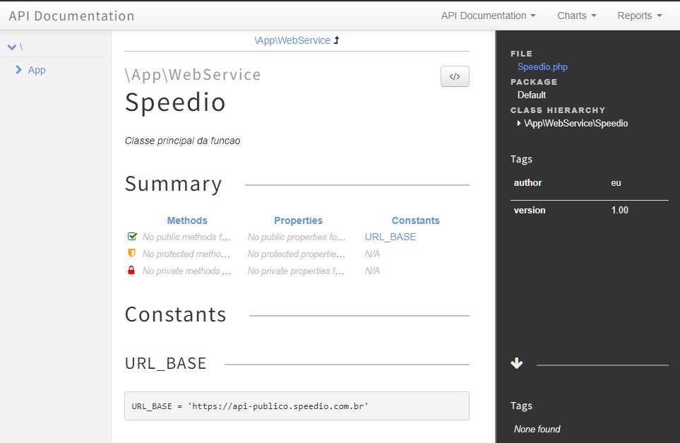

# Consultar_CNPJ

 Projeto e Documentação

A partir do projeto  `Consulta de CNPJs em PHP: Consumindo a API gratuita do Speedio - WDEV` disponivel  em `https://www.youtube.com/watch?v=BE6LhjGIfrE`  ter  o projeto e a documentação dele. 

Um dos motivos de escolha deste projeto é uque o desenvolvedor que libera estes videos já tem  o Habito de documentar seu código. 

O principal deste projeto  é criar a Documentação dele usando o phpDocumentor. 

## Iniciando o composer

Abrindo o terminal no próprio VSCode, comando para inicialização:

    composer init

Apenas  solicitou o nome do arquivo `vendor/consulta` para todas as demais questões deixei em branco, ate a criação.

## Adicionando o PhpDocumentor

Irei já adicionar o phpDocumentor mesmo ainda não tendo iniciado o projeto.

No arquivo composer.json irei adicionar o require para o phpdocumentor

    
    "require-dev": {
        "phpdocumentor/phpdocumentor": "2.*"
    }

Agora para o composer instalar

    composer update

Agora para criar as pastas de saida do arquivo 

    vendor/bin/phpdoc.bat 

Criou a pasta  `output`na raiz do projeto, apneas com a pasta `build`e mais nada;

### Começando o projeto

Vídeos sugeridos:

* cURL - Enviando requisições HTTP com a libcurl do PHP - https://youtu.be/b1wBRZI6dQ8
* Manipulando JSONs com PHP: Encode, decode e constantes: https://youtu.be/MYMGMg1StVk

Sites utilizados:
* Speedio: https://apiconsultacnpj.com.br/

No site da API  (Speedio ) há um demonstrativo de como usar, e como será o retorno 

    $ curl 'https://api-publica.speedio.com.br/buscarcnpj?cnpj=00000000000191'

#### Configurando  o composer.json 

Renomeando para ficar igual ao video 

    "autoload": {
        "psr-4": {
            "App\\": "app/"
        }
    },

Para configurar seria necessario rodar o comando  `composer init`   mas ele seria para  Iniciar o composer,  portanto usei  o  `composer update`;

e criar a pasta principal do projeto:  `app`;

Dentro da pasta app iremos criar a pasta `WebService`e dentro da pasta webService iremos criar o arquivo  `Speedio.php`

Dentro deste aquivo iremos criar a classe e a constante `URL_BASE`;

Neste momento já iremos criar a primeira documentação do sistema ,  para verificar se esta indo corretamente 

    vendor/bin/phpdoc.bat -d "App\WebService"

Dentro da pasta  `output`foram criados varios arquivos,  e o principal `index.html` , abrindo este arquivo já temos a primeira documentação do sistema. 

    

    

Pode-se navegar por algumas partes desta pagina.

Acrescentei novos comentários e rodei novamente a documentação, entretanto os novos comentarios não foram inseridos na Documentação ;

Adicionado mais comentarios para a documentação e agora consta no index.html

    

    
Criando o método de consulta ao CNPJ;

Mesmo tendo apenas criado o Metodo já o documentamos e o resultado  ficou assim:

 
    
 

Vamos criar o arquivo que irá utilizar a classe .

Na raiz do projeto  criar o arquivo  `consultar.php`

Sendo documentado os passos a passos sendo gerado no arquivo.

Usando linha de comando para rodar o aquivo

    php consultar.php

Mostrou as informações como esperado. 

Para gerar a documentação estamos usando o diretório de origem como sendo  o  "App\WebService" sendo assim ,  a documentação só ira pegar  o que estiver dentro deste arquivo. 

Vamos testar para fazer a Documentação pegar tudo o que esta dentro  do Wdev ... acredito que daria M###  pois iria pegar também  a própria Documentacao em si. 

Fiz um  backup da pasta `ConsultaCNPJ` renomeei para `ConsultaCNPJ_02 ` ,  eliminei da pasta copia os arquivos do composer, 
deixando apenas os arquivos do projeto em si.

Gerei a documentação fora da pasta de origem, criando uma nova pasta de destino para a documentação.

    E:\Wamp\www> vendor/bin/phpdoc.bat -d "E:/wamp/www/Consultacnpj_02/WDev" -t "E:/wamp/www/Documentacao/consultacnpj"

Mesmo nesta situação o arquivo `consultar.php` não foi documentado. 

https://api-publica.speedio.com.br/buscarcnpj?cnpj=00000000000191

https://api-publico.speedio.com.br/buscarcnpj?cnpj=00000000000191"

Da forma apresentada no video, não deu certo:

    $curl = curl_init();
    curl_setopt_array( $curl, [
        CURLOPT_URL => $endpoint,
        CURLOPT_RETURNTRANSFER => true,
        CURLOPT_CUSTOMREQUEST => 'GET'
    ]);
    curl_close( $curl );

Uma pesquisa rápida na internet ja mostrou outras formas e com isto trouxe as informações:

    $headers = array("Content-Type: application/json; charset=utf-8");
    $url = "https://swapi.dev/api/people/";
    $ch = curl_init($url);
    curl_setopt($ch, CURLOPT_RETURNTRANSFER, true);
    curl_setopt($ch, CURLOPT_SSL_VERIFYPEER, false);
    curl_setopt($ch, CURLOPT_HTTPHEADER, $headers);
    $resultado = json_decode(curl_exec($ch));
    var_dump($resultado);

Apenas realizado os ajustes necessários para o nosso codigo.

Resultado:

    http://localhost/ConsultaCNPJ/WDev/consultar.php

## Finalizado

O conteudo do video  foi finalziado e apresentando as informações da forma correta 

## Documentação

A forma da apresentação da Documentação  não parece muito elegante,  e como ela é gerada parece  não estar correta, fazendo ser necessário mais estudo das configurações do PhpDoc para melhorar a qualidade da informação a ser apresentada. 

